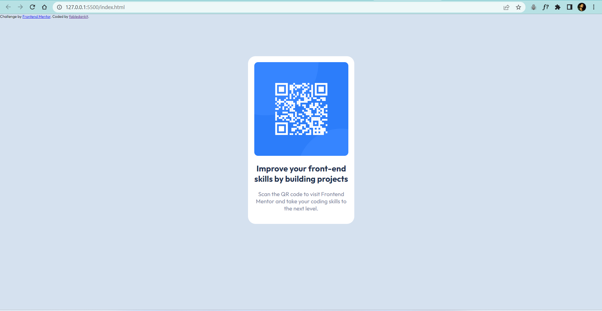

# Frontend Mentor - QR code component solution

This is a solution to the [QR code component challenge on Frontend Mentor](https://www.frontendmentor.io/challenges/qr-code-component-iux_sIO_H).
## Table of contents

  - [Screenshot](#screenshot)
  - [Links](#links)
- [My process](#my-process)
  - [Built with](#built-with)
  - [What I learned](#what-i-learned)
  - [Useful resources](#useful-resources)
- [Author](#author)

### Screenshot

Add a screenshot of your solution. The easiest way to do this is to use Firefox to view your project, right-click the page and select "Take a Screenshot". You can choose either a full-height screenshot or a cropped one based on how long the page is. If it's very long, it might be best to crop it.

Alternatively, you can use a tool like [FireShot](https://getfireshot.com/) to take the screenshot. FireShot has a free option, so you don't need to purchase it. 

Then crop/optimize/edit your image however you like, add it to your project, and update the file path in the image above.

**Note: Delete this note and the paragraphs above when you add your screenshot. If you prefer not to add a screenshot, feel free to remove this entire section.**

### Links

- Solution URL: [Add solution URL here](https://your-solution-url.com)
- Live Site URL: [Add live site URL here](https://your-live-site-url.com)

## My process

Looked at the design images. Based the width of the card on the font size of the paragraph that was provided in the css file.

### Built with

- Semantic HTML5 markup
- CSS custom properties

### What I learned

Learned to guess the mesurements based on the size of font provided, by seeing how it wraps in the design. Didn't know about hsl values before.

### Continued development

Use this section to outline areas that you want to continue focusing on in future projects. These could be concepts you're still not completely comfortable with or techniques you found useful that you want to refine and perfect.

**Note: Delete this note and the content within this section and replace with your own plans for continued development.**

### Useful resources

- [Color conversions](https://convertingcolors.com/) - Used this site to convert HSL values to HEX or RGB

## Author

- Website - [Ankit Kumar](https://www.nkit.space/)
- Frontend Mentor - [@fabledankit](https://www.frontendmentor.io/profile/fabledankit)
- Twitter - [@fabledankit](https://www.twitter.com/fabledankit)