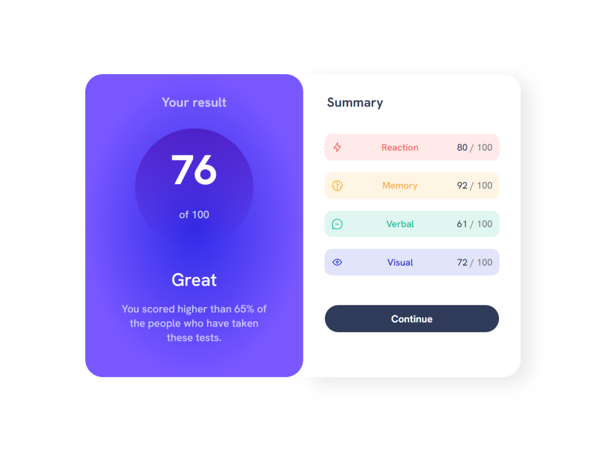

# Frontend Mentor - Results summary component solution

This is a solution to the [Results summary component challenge on Frontend Mentor](https://www.frontendmentor.io/challenges/results-summary-component-CE_K6s0maV). Frontend Mentor challenges help you improve your coding skills by building realistic projects.

## Table of contents

- [The challenge](#the-challenge)
- [Screenshot](#screenshot)
- [Links](#links)
- [My process](#my-process)
  - [Built with](#built-with)
- [Author](#author)

### The challenge

Users should be able to:

- View the optimal layout for the interface depending on their device's screen size
- See hover and focus states for all interactive elements on the page

### Screenshot

### Links

- Solution URL: [Add solution URL here](https://your-solution-url.com)
- Live Site URL: [Add live site URL here](https://your-live-site-url.com)

## My process

Imported design files to figma. Drew outlines on design, to get the esimate of the dimensions. Then wrote the markup and css.

### Built with

- Semantic HTML5 markup
- CSS custom properties
- Flexbox
- CSS Grid

## Author

- Website - [Ankit Kumar](https://www.nkit.space)
- Frontend Mentor - [@cyokai](https://www.frontendmentor.io/profile/cyokai)
- Twitter - [@fabledankit](https://www.twitter.com/fabledankit)
